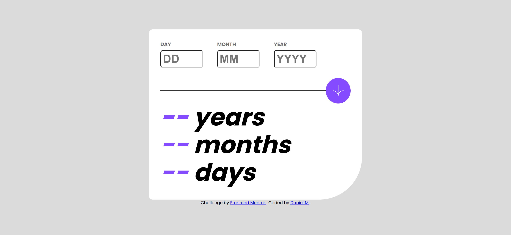
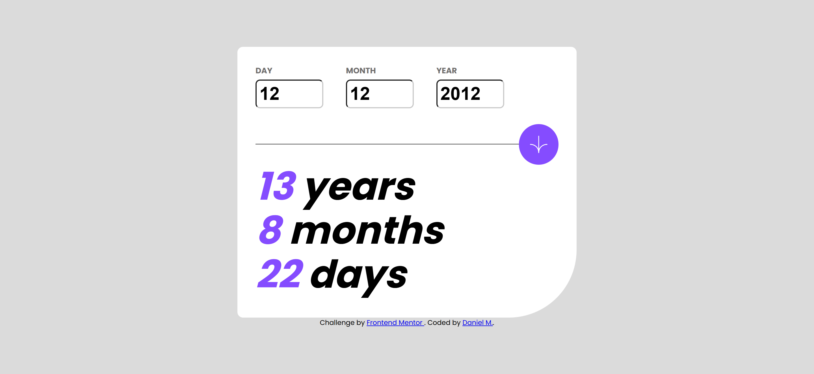
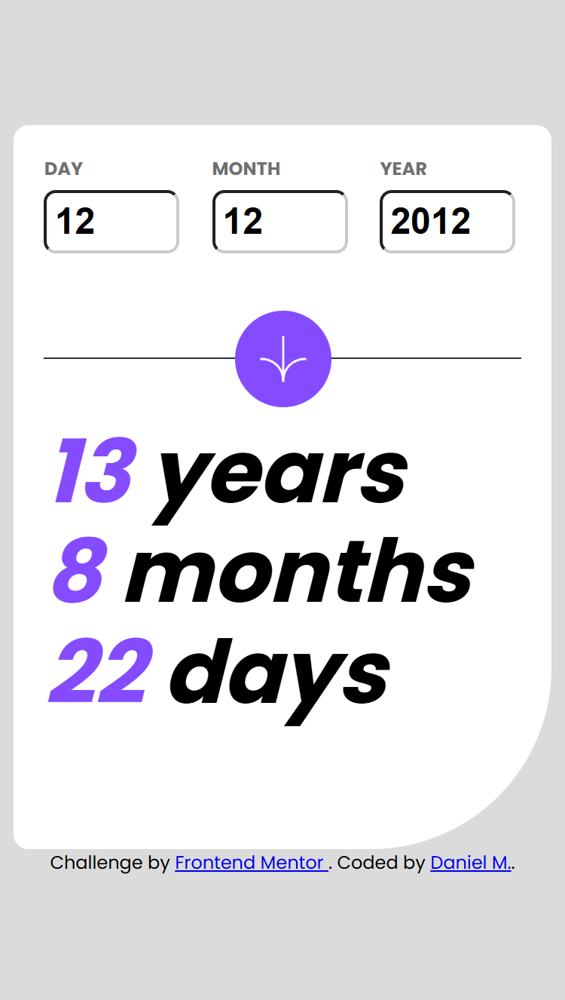
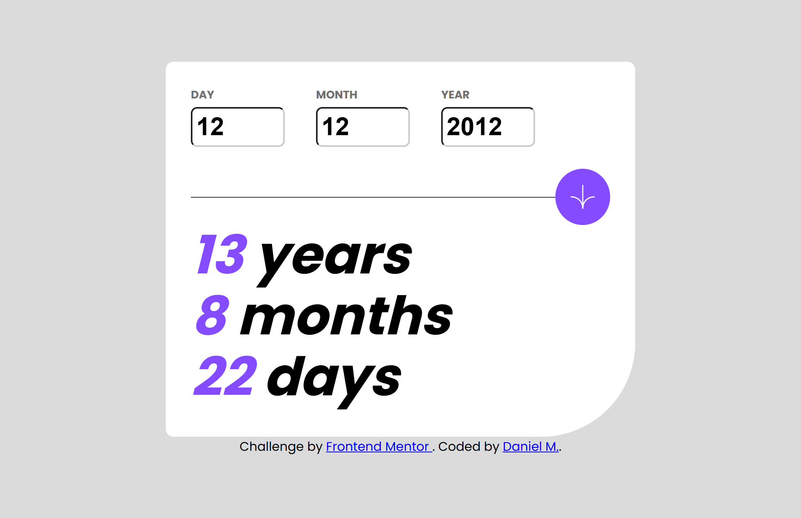
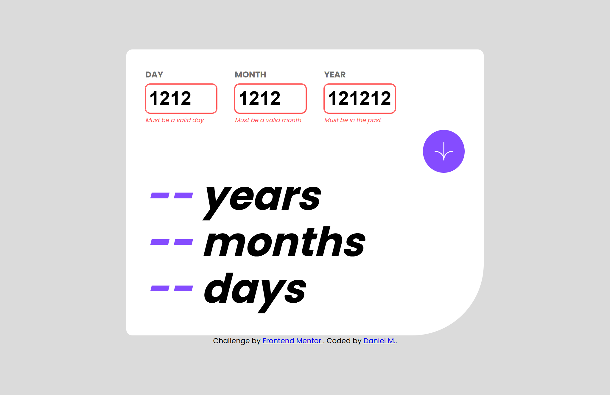

# Frontend Mentor - Age calculator app solution

This is a solution to the [Age calculator app challenge on Frontend Mentor](https://www.frontendmentor.io/challenges/age-calculator-app-dF9DFFpj-Q). Frontend Mentor challenges help you improve your coding skills by building realistic projects. 

## Table of contents

- [Overview](#overview)
  - [The challenge](#the-challenge)
  - [Screenshot](#screenshot)
  - [Links](#links)
- [My process](#my-process)
  - [Built with](#built-with)
  - [What I learned](#what-i-learned)
  - [Continued development](#continued-development)
  - [Useful resources](#useful-resources)
  - [AI Collaboration](#ai-collaboration)
- [Author](#author)
- [Acknowledgments](#acknowledgments)

## Overview

### The challenge

Users should be able to:

- View an age in years, months, and days after submitting a valid date through the form
- Receive validation errors if:
  - Any field is empty when the form is submitted
  - The day number is not between 1-31
  - The month number is not between 1-12
  - The year is in the future
  - The date is invalid e.g. 31/04/1991 (there are 30 days in April)
- View the optimal layout for the interface depending on their device's screen size
- See hover and focus states for all interactive elements on the page
- **Bonus**: See the age numbers animate to their final number when the form is submitted

### Screenshot

**Desktop design**



**Desktop design - complete**



**Mobile design**



**Complete state (result after submitting a valid date)**



**Error state - empty fields**


**Error state - invalid date**



### Links

- Solution URL: [Vercel](https://frontend-mentor-challenge-solutions-five.vercel.app/age-calculator-app-main/)
- Live Site URL: [GitHub](https://github.com/DanielManaloto/frontend-mentor-challenge-solutions/tree/main/age-calculator-app-main)

## My process

### Built with

- Semantic HTML5 markup
- CSS
- Flexbox
- Vanilla JavaScript (no frameworks or libraries)

### What I learned

This project was my chance to practice plain JavaScript with the DOM. No frameworks, just HTML, CSS (Flexbox) and one `app.js` file. Here are the main things I picked up.

**1. Grabbing elements once and reusing them**

I select every input, error message and result element at the top of the file with `getElementById`, so the rest of the code can use them without searching the DOM again.

```js
const dayInput = document.getElementById("day");
const dayError = document.getElementById("day-error");
const yearResult = document.getElementById("year-result");
```

**2. Stopping the form from reloading the page**

A submit button inside a form refreshes the page by default. `e.preventDefault()` stops that so I can run my own function instead.

```js
submitBtn.addEventListener("click", function (e) {
  e.preventDefault();
  calculateAge();
});
```

**3. Turning input text into numbers**

Input values are always strings. `parseInt(value, 10)` converts them to base-10 numbers so I can compare them properly. I also use `.trim()` on the raw value to check for empty fields.

```js
const day = parseInt(dayInput.value, 10);

if (!dayInput.value.trim()) {
  showError(dayInput, dayError, "This field is required");
}
```

**4. Checking for a real date (the rollover trick)**

This was the trickiest part. JavaScript's `Date` doesn't complain about `31/04/1991`. It quietly rolls over to 1 May. So to catch invalid dates, I build the date and then check that the year, month and day still match what the user typed.

```js
const testDate = new Date(year, month - 1, day);
const isRealDate =
  testDate.getFullYear() === year &&
  testDate.getMonth() === month - 1 &&
  testDate.getDate() === day;
```

I also learned that months in `Date` are zero-based (January is `0`), which is why there's a `month - 1` everywhere.

**5. Calculating age with "borrowing"**

Subtracting the dates gives me raw differences, but they can be negative. It works like subtraction on paper: if the days are negative, I borrow from the months, and if the months are negative, I borrow from the years. The order matters: days first, then months.

```js
if (days < 0) {
  months--;
  const daysInPrevMonth = new Date(
    today.getFullYear(),
    today.getMonth(),
    0
  ).getDate();
  days += daysInPrevMonth;
}

if (months < 0) {
  years--;
  months += 12;
}
```

Using day `0` of a month gives the last day of the previous month, which is a neat way to find how many days that month had.

**6. Keeping the code organized with small functions**

Splitting the logic into functions that each do one job made it much easier to read and debug:

- `calculateAge()` runs the whole flow
- `validateInputs()` checks the values and returns `true` or `false`
- `showError()` adds the error styles and message
- `clearErrors()` resets everything before each new submit

**7. Toggling styles with `classList`**

Instead of changing styles directly in JavaScript, I add and remove CSS classes (`error-input` and `show`) and let the CSS handle how it looks. I also looped over arrays of elements with `forEach` to avoid repeating myself.

```js
function showError(input, errorEl, message) {
  input.classList.add("error-input");
  errorEl.textContent = message;
  errorEl.classList.add("show");
}

function clearErrors() {
  [dayInput, monthInput, yearInput].forEach((input) =>
    input.classList.remove("error-input")
  );
}
```

### Continued development

For now, I don't have any specific plans for continued development. I want to keep practicing by working on more projects and gradually improve my HTML and CSS skills as I gain more experience.

### Useful resources

- [MDN - Date](https://developer.mozilla.org/en-US/docs/Web/JavaScript/Reference/Global_Objects/Date) - Helped me understand how months are zero-based and how dates roll over.
- [MDN - Event.preventDefault()](https://developer.mozilla.org/en-US/docs/Web/API/Event/preventDefault) - Explained why my form kept refreshing the page.
- [MDN - Element.classList](https://developer.mozilla.org/en-US/docs/Web/API/Element/classList) - Useful for adding and removing the error styles.

### AI Collaboration

In creating this solution, AI was used mainly for debugging and exploring possible solutions to various errors and bugs encountered throughout development. I mainly used the Claude Sonnet 5 model available on the website. AI-generated code was used as minimally as possible so that I could continue learning and developing my skills in frontend programming.

## Author

- GitHub - [DanielManaloto](https://github.com/DanielManaloto)

## Acknowledgments

I would like to thank Frontend Mentor for providing the challenge and the opportunity to practice and improve my frontend development skills.
