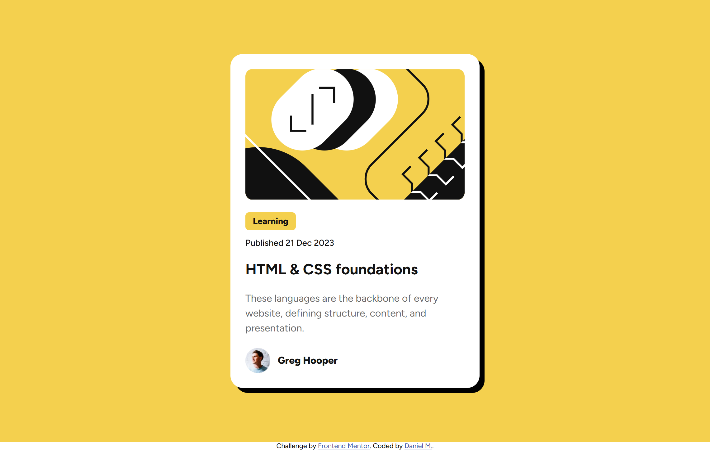
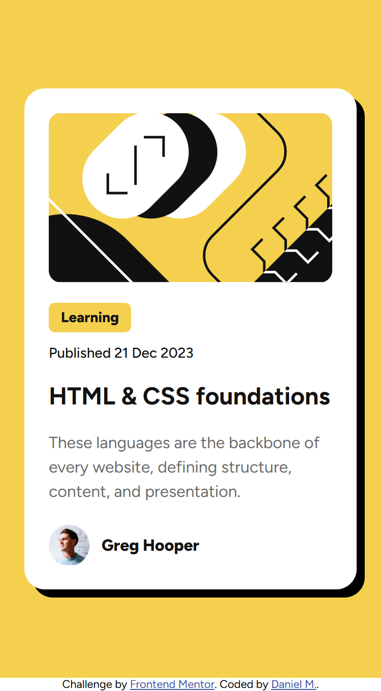

# Frontend Mentor - Blog preview card solution

This is a solution to the [Blog preview card challenge on Frontend Mentor](https://www.frontendmentor.io/challenges/blog-preview-card-ckPaj01IcS). Frontend Mentor challenges help you improve your coding skills by building realistic projects. 

## Table of contents

- [Overview](#overview)
  - [The challenge](#the-challenge)
  - [Screenshot](#screenshot)
  - [Links](#links)
- [My process](#my-process)
  - [Built with](#built-with)
  - [What I learned](#what-i-learned)
  - [Continued development](#continued-development)
  - [Useful resources](#useful-resources)
  - [AI Collaboration](#ai-collaboration)
- [Author](#author)
- [Acknowledgments](#acknowledgments)

**Note: Delete this note and update the table of contents based on what sections you keep.**

## Overview

### The challenge

Users should be able to:

- See hover and focus states for all interactive elements on the page

### Screenshot


<p style="text-align: center;">Desktop Design</p>


<p style="text-align: center;">Mobile Design</p>


<p style="text-align: center;">Active State</p>

### Links

- Solution URL: [Add solution URL here](https://your-solution-url.com)

## My process

### Built with

- Semantic HTML5 markup
- CSS custom properties
- Flexbox
- Mobile-first workflow
- VS Code

### What I learned

In this solution i learned about css pseudo class, namely the `:hover` pseudo class for interactable elements. A CSS pseudo-class is a keyword added to a selector that specifies a special state of the selected elements. It allows you to style an element based on user interaction, document structure, or state changes without needing JavaScript. 
```css
h2 {
  color: hsl(0, 0%, 7%);
  font-weight: 700;
  line-height: 1.2;
}

h2:hover {
  cursor: pointer;
  color: hsl(47, 88%, 63%);
}
```
### Continued development

For now, I don't have any specific plans for continued development. I want to keep practicing by working on more projects and gradually improve my HTML and CSS skills as I gain more experience.

### Useful resources

- [MDN Web Docs](https://developer.mozilla.org/en-US/docs/Web/CSS/Reference/Selectors/Pseudo-classes)  – CSS Pseudo-classes: I used this as a reference for the `:hover` pseudo-class. It helped me understand how to apply different styles when the user hovers over an element, which was useful for adding the interactive hover effects required in this challenge.

### AI Collaboration

In creating this solution, AI was used mainly for debugging and exploring possible solutions to various errors and bugs encountered throughout development. I mainly used the Claude Sonnet 5 model available on the website. AI-generated code was used as minimally as possible so that I could continue learning and developing my skills in frontend programming.

## Author

- GitHub - [DanielManaloto](https://github.com/DanielManaloto)

## Acknowledgments

I would like to thank Frontend Mentor for providing the challenge and the opportunity to practice and improve my frontend development skills.

