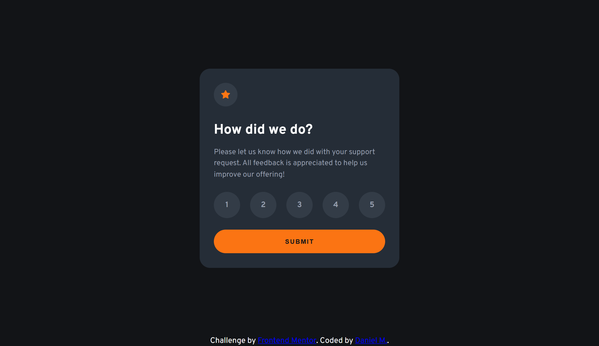
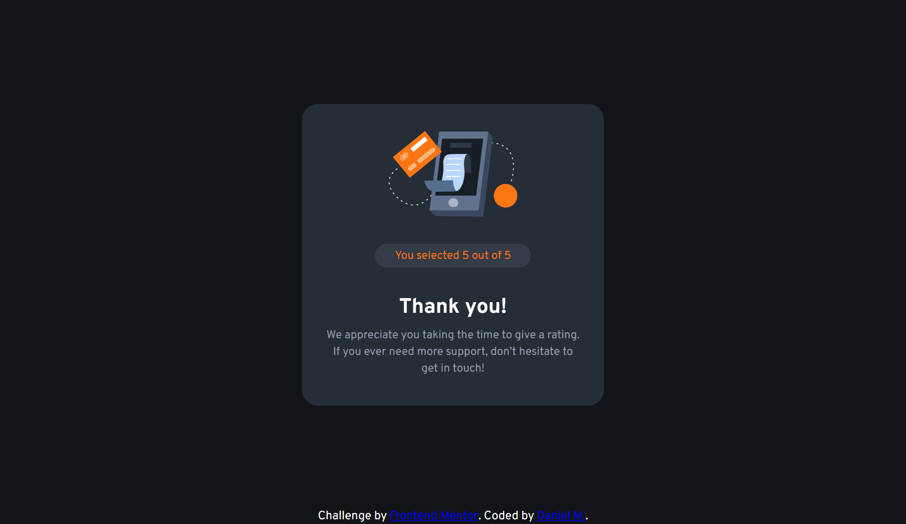
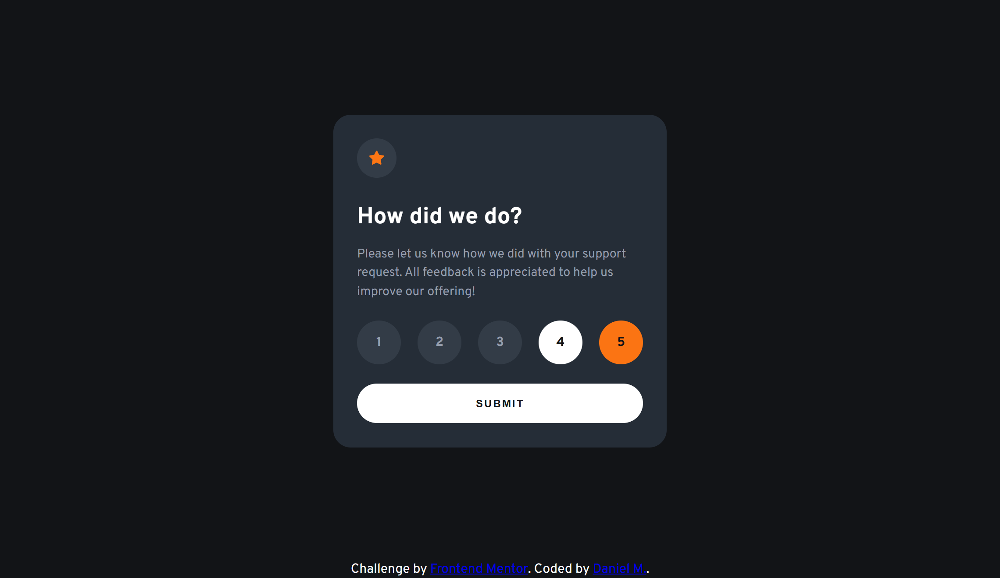
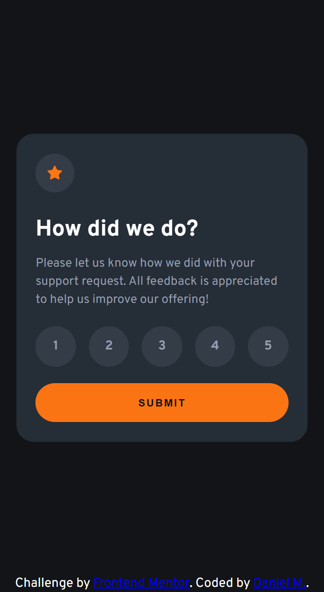
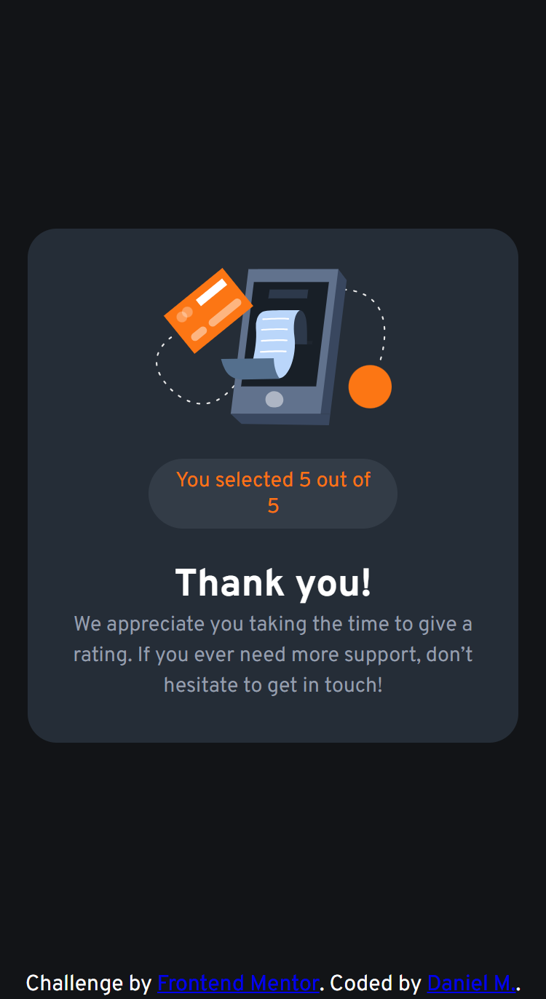

# Frontend Mentor - Interactive rating component solution

This is a solution to the Interactive rating component challenge on Frontend Mentor. Frontend Mentor challenges help you improve your coding skills by building realistic projects.

## Table of contents

* [Overview](#overview)

  * [The challenge](#the-challenge)
  * [Screenshot](#screenshot)
  * [Links](#links)
* [My process](#my-process)

  * [Built with](#built-with)
  * [What I learned](#what-i-learned)
  * [Continued development](#continued-development)
  * [Useful resources](#useful-resources)
  * [AI Collaboration](#ai-collaboration)
* [Author](#author)
* [Acknowledgments](#acknowledgments)

## Overview

### The challenge

Users should be able to:

* View the optimal layout for the app depending on their device's screen size
* See hover states for all interactive elements on the page
* Select and submit a number rating
* See the "Thank you" card state after submitting a rating

### Screenshot



<p style="text-align: center;">Desktop Design</p>



<p style="text-align: center;">Desktop Thank You State</p>



<p style="text-align: center;">Active State</p>



<p style="text-align: center;">Mobile Design</p>



<p style="text-align: center;">Mobile Thank You State</p>

### Links

- Solution URL: [Vercel](https://frontend-mentor-challenge-solutions-five.vercel.app/interactive-rating-component-main/)
- Live Site URL: [GitHub](https://github.com/DanielManaloto/frontend-mentor-challenge-solutions/tree/main/interactive-rating-component-main)

## My process

### Built with

* Semantic HTML5 markup
* CSS custom properties
* Flexbox
* Desktop-first workflow
* VS Code

### What I learned

In this solution, I explored how to change the state of a website. The state change is performed by creating a submit button that changes the display of the initial container to `none` and then displays another container that was previously hidden. Essentially, this involves manipulating the `display` style in JavaScript to change the content shown in the HTML.

```javascript
submitButton.addEventListener("click", function () {
  const selectedInput = document.querySelector('input[name="rating"]:checked');

  if (!selectedInput) {
    return;
  }

  selectedRatingText.textContent = selectedInput.value;

  // Manipulate display in JavaScript
  ratingState.style.display = "none";
  thankYouState.style.display = "flex";
});
```

The next thing I learned was how to implement a rating component. The first thing that came to mind was creating five separate generic buttons, but I would then need to add JavaScript to handle the selection so that only one item could be selected at a time.

The element that already has this behavior is a radio button. The downside is that radio buttons have circles beside them and labels beside them. One way to resolve this is to hide the radio buttons and use their labels to create the visual appearance of the rating buttons.

This solves both the need to select only one item at a time and the need to make the options look like generic buttons, without requiring additional JavaScript code.

```html
<div id="rating">
  <input type="radio" id="rate1" name="rating" value="1" />
  <label for="rate1">1</label>

  <input type="radio" id="rate2" name="rating" value="2" />
  <label for="rate2">2</label>

  <input type="radio" id="rate3" name="rating" value="3" />
  <label for="rate3">3</label>

  <input type="radio" id="rate4" name="rating" value="4" />
  <label for="rate4">4</label>

  <input type="radio" id="rate5" name="rating" value="5" />
  <label for="rate5">5</label>
</div>

<button id="submit-button">SUBMIT</button>
```

```css
input {
  display: none;
}

label {
  width: 55px;
  aspect-ratio: 1;
  border-radius: 50%;
  display: inline-flex;
  justify-content: center;
  align-items: center;
  background: hsl(213, 16%, 24%);
  cursor: pointer;
  color: hsl(217, 12%, 63%);
  font-weight: 600;
}

input:hover + label {
  background: hsl(25, 97%, 53%);
  color: hsl(216, 12%, 8%);
}

input:checked + label {
  background: white;
  color: hsl(216, 12%, 8%);
}
```

### AI Collaboration

In creating this solution, AI was used mainly for debugging and exploring possible solutions to various errors and bugs encountered throughout development. I mainly used the Claude Sonnet 5 model available on the website. AI-generated code was used as minimally as possible so that I could continue learning and developing my skills in frontend programming.

## Author

- GitHub - [DanielManaloto](https://github.com/DanielManaloto)

## Acknowledgments

I would like to thank Frontend Mentor for providing the challenge and the opportunity to practice and improve my frontend development skills.
