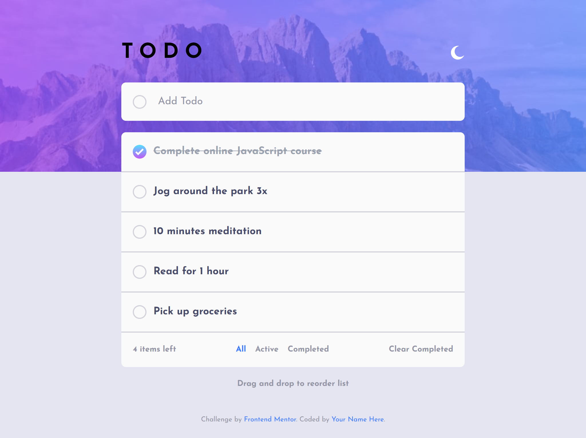
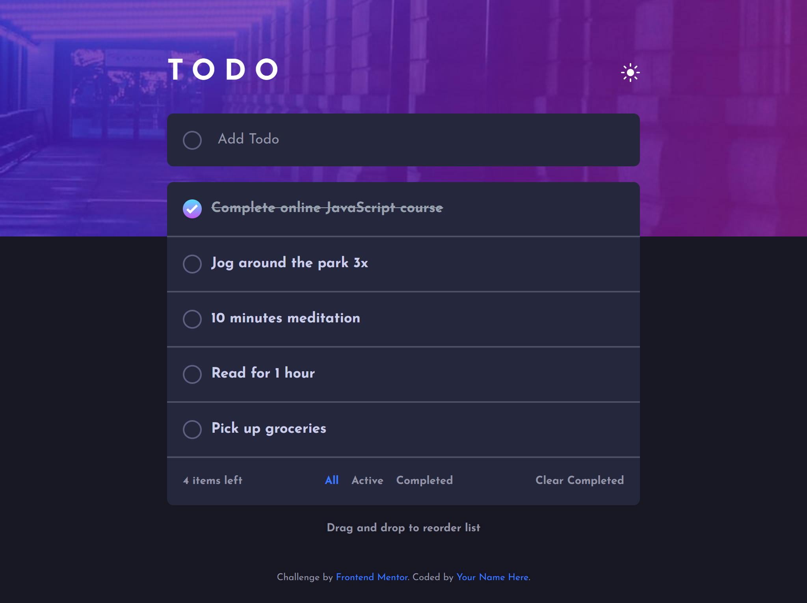
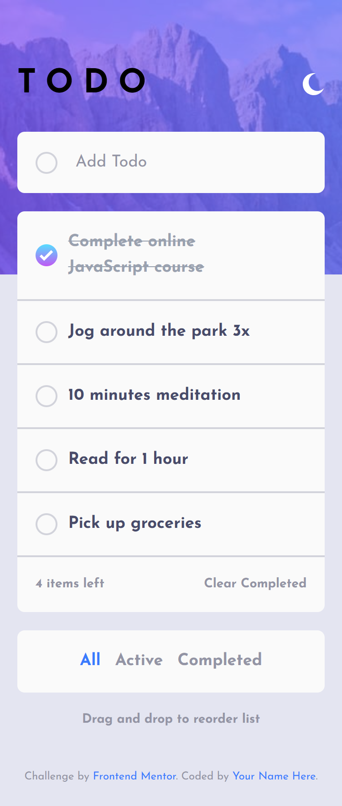
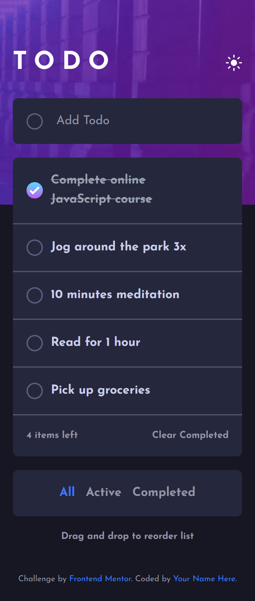

# Frontend Mentor - Todo app solution

This is a solution to the [Todo app challenge on Frontend Mentor](https://www.frontendmentor.io/challenges/todo-app-Su1_KokOW). Frontend Mentor challenges help you improve your coding skills by building realistic projects. 

## Table of contents

- [Overview](#overview)
  - [The challenge](#the-challenge)
  - [Screenshot](#screenshot)
  - [Links](#links)
- [My process](#my-process)
  - [Built with](#built-with)
  - [What I learned](#what-i-learned)
  - [Continued development](#continued-development)
  - [Useful resources](#useful-resources)
  - [AI Collaboration](#ai-collaboration)
- [Author](#author)
- [Acknowledgments](#acknowledgments)


## Overview

### The challenge

Users should be able to:

- View the optimal layout for the app depending on their device's screen size
- See hover states for all interactive elements on the page
- Add new todos to the list
- Mark todos as complete
- Delete todos from the list
- Filter by all/active/complete todos
- Clear all completed todos
- Toggle light and dark mode
- **Bonus**: Drag and drop to reorder items on the list

### Screenshot


<p style="text-align: center;">Desktop Design Light.</p>


<p style="text-align: center;">Desktop Design Dark.</p>


<p style="text-align: center;">Desktop Design Light.</p>


<p style="text-align: center;">Desktop Design dark.</p>

### Links

- Solution URL: [Vercel](https://frontend-mentor-challenge-solutions-five.vercel.app/todo-app-main/)
- Live Site URL: [GitHub](https://github.com/DanielManaloto/frontend-mentor-challenge-solutions/tree/main/todo-app-main)


## My process

### Built with

- Semantic HTML5 markup
- CSS custom properties
- Tailwind CSS
- Flexbox
- Mobile-first workflow
- VS Code
- Node.js
- Vite
- React

### What I learned

Building this project deepened my understanding of managing state in React beyond a single `useState` call, and gave me a first real implementation of drag and drop.

The core of the app is one `todos` array in state, with handler functions that update it immutably:

```jsx
const [todos, setTodos] = useState([...]);

function toggleTodo(id) {
  setTodos((prev) =>
    prev.map((t) => (t.id === id ? { ...t, completed: !t.completed } : t))
  );
}
```

I also learned to sync state with the DOM and `localStorage` using `useEffect`, so the dark mode preference persists across reloads and falls back to the OS-level setting on first visit:

```jsx
const [isDark, setIsDark] = useState(() => {
  const stored = localStorage.getItem("theme");
  if (stored) return stored === "dark";
  return window.matchMedia("(prefers-color-scheme: dark)").matches;
});

useEffect(() => {
  document.documentElement.classList.toggle("dark", isDark);
  localStorage.setItem("theme", isDark ? "dark" : "light");
}, [isDark]);
```

A similar `matchMedia` + event listener pattern let me detect the desktop breakpoint in JavaScript rather than only in CSS, which was necessary because the filter buttons move to a different spot in the layout on desktop instead of just changing style.

The bonus feature — drag and drop to reorder the list — was the biggest learning curve. I used the browser's native HTML5 Drag and Drop API rather than a library, wiring up four events on each list item:

```jsx
<li
  draggable
  onDragStart={(e) => handleDragStart(e, todo.id)}
  onDragOver={(e) => handleDragOver(e, todo.id)}
  onDrop={(e) => handleDrop(e, todo.id)}
  onDragEnd={handleDragEnd}
>
```

The trickiest part was realizing reordering has to operate on each todo's `id`, not its position in the rendered list — since the visible list shrinks when the Active or Completed filter is applied, using array indices would move the wrong items:

```jsx
function handleDrop(e, targetId) {
  e.preventDefault();
  setTodos((prev) => {
    const updated = [...prev];
    const fromIndex = updated.findIndex((t) => t.id === draggedId);
    const toIndex = updated.findIndex((t) => t.id === targetId);
    const [moved] = updated.splice(fromIndex, 1);
    updated.splice(toIndex, 0, moved);
    return updated;
  });
}
```

I also learned that `e.preventDefault()` inside `onDragOver` is required, since the browser blocks a drop by default, and that calling `dataTransfer.setData()` in `onDragStart` is needed for the drag to initiate consistently across browsers like Firefox.

### Continued development

For now, I don't have any specific plans for continued development. I want to keep practicing by working on more projects and gradually improve my HTML and CSS skills as I gain more experience.

### Useful resources

- [MDN: HTML Drag and Drop API](https://developer.mozilla.org/en-US/docs/Web/API/HTML_Drag_and_Drop_API) - Explains the full drag event lifecycle (`dragstart`, `dragover`, `drop`, `dragend`) and why `preventDefault()` is required on `dragover` for a drop to be allowed.
- [React docs: useState](https://react.dev/reference/react/useState) and [useEffect](https://react.dev/reference/react/useEffect) - Reference for the functional update form of `setState` and for syncing state with external systems like `localStorage` and `matchMedia`.

### AI Collaboration

In creating this solution, AI was used mainly for debugging and for working through how to implement the drag-and-drop reordering feature, since the native HTML5 Drag and Drop API is less commonly documented than third-party alternatives. I mainly used the Claude Sonnet 5 model available on the website. AI-generated code was used as minimally as possible so that I could continue learning and developing my skills in frontend programming.

## Author

- GitHub - [DanielManaloto](https://github.com/DanielManaloto)

## Acknowledgments

I would like to thank Frontend Mentor for providing the challenge and the opportunity to practice and improve my frontend development skills.