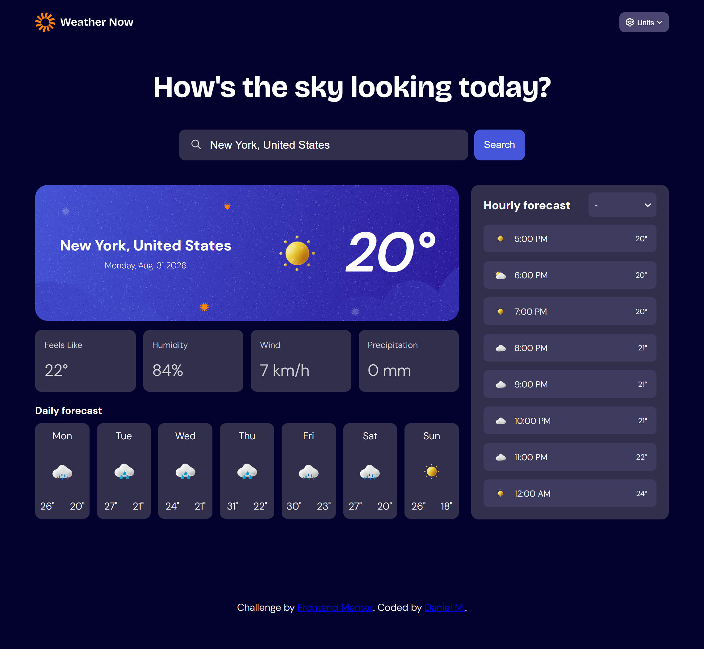
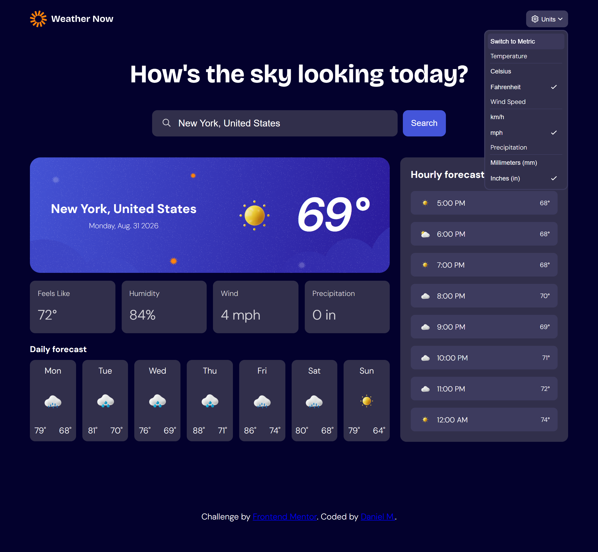
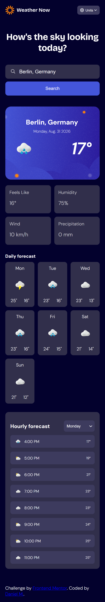
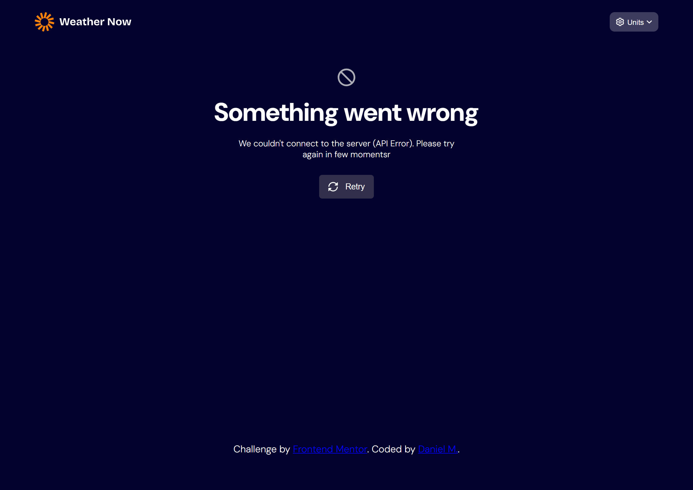
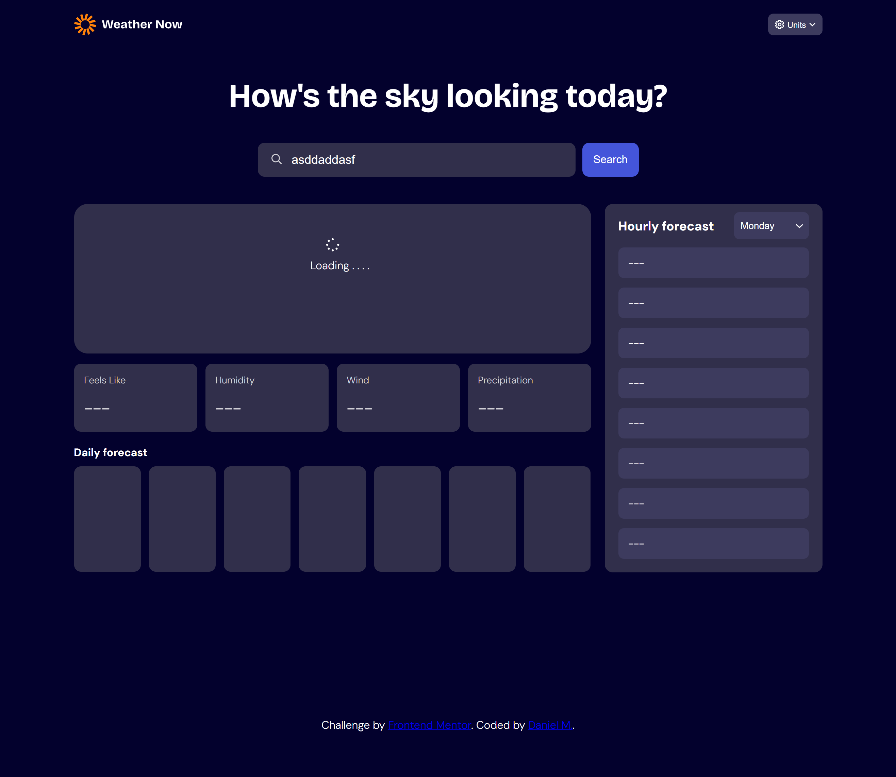
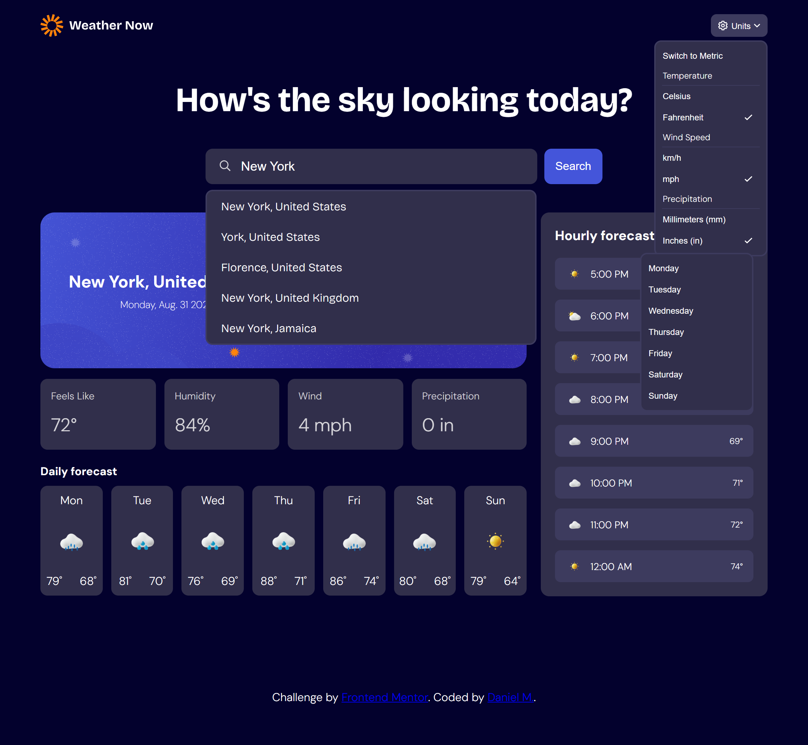

# Frontend Mentor - Weather app solution

This is a solution to the [Weather app challenge on Frontend Mentor](https://www.frontendmentor.io/challenges/weather-app-K1FhddVm49). Frontend Mentor challenges help you improve your coding skills by building realistic projects. 

## Table of contents

- [Overview](#overview)
  - [The challenge](#the-challenge)
  - [Screenshot](#screenshot)
  - [Links](#links)
- [My process](#my-process)
  - [Built with](#built-with)
  - [What I learned](#what-i-learned)
  - [Useful resources](#useful-resources)
  - [AI Collaboration](#ai-collaboration)
- [Author](#author)
## Overview

### The challenge

Users should be able to:

- Search for weather information by entering a location in the search bar
- View current weather conditions, including temperature, weather icons, and location details
- See additional weather metrics such as "feels like" temperature, humidity percentage, wind speed, and precipitation amounts
- Browse a 7-day weather forecast with daily high/low temperatures and weather icons
- View an hourly forecast showing temperature changes throughout the day
- Switch between different days of the week using the day selector in the hourly forecast section
- Toggle between Imperial and Metric measurement units, including temperature, wind speed, and precipitation units, via the units dropdown
- View the optimal layout for the interface depending on their device's screen size
- See hover and focus states for all interactive elements on the page

### Screenshot


<p style="text-align: center;">Desktop Design Metric.</p>


<p style="text-align: center;">Desktop Design Imperial.</p>


<p style="text-align: center;">Mobile Design.</p>


<p style="text-align: center;">No Result State.</p>


<p style="text-align: center;">Loading State.</p>


<p style="text-align: center;">Dropdown State.</p>

### Links

- Solution URL: [Add solution URL here](https://your-solution-url.com)

## My process

### Built with

- Semantic HTML5 markup
- CSS custom properties
- Flexbox
- CSS Grid
- Mobile-first workflow
- VS Code
- Node.js
- Vite
- Open-Meteo API

### What I learned

Most of the HTML structure and CSS design principles were previously learned through other Frontend Mentor challenges. What I learned while creating this solution was how to make requests, use external packages, and work with APIs based on their documentation.

The first thing I learned was how to set up Node.js, as it is required for using external packages in JavaScript.

```bash
npm init
npm install openmeteo
```

I also learned to use Vite to create a local server and run the website on localhost. Previously, I used the Live Server extension in VS Code to view websites, but that approach was no longer suitable because the project uses Node.js.

The main function for creating and retrieving requests was mostly provided by the API documentation, but I had to translate the TypeScript example into regular JavaScript.

```javascript
async function fetchWeatherData(latitude, longitude) {
    const params = {
        latitude,
        longitude,
        daily: ["temperature_2m_min", "temperature_2m_max", "weather_code"],
        hourly: ["temperature_2m", "weather_code"],
        current: [
            "weather_code",
            "temperature_2m",
            "apparent_temperature",
            "relative_humidity_2m",
            "precipitation",
            "wind_speed_10m",
            "is_day"
        ]
    };

    const responses = await fetchWeatherApi(FORECAST_URL, params);
    const response = responses[0];
    const utcOffsetSeconds = response.utcOffsetSeconds();

    const current = response.current();
    const hourly = response.hourly();
    const daily = response.daily();

    if (!current || !hourly || !daily) {
        throw new Error("Weather data is unavailable.");
    }

    return {
        current: {
            time: new Date((Number(current.time()) + utcOffsetSeconds) * 1000),
            weather_code: current.variables(0).value(),
            temperature_2m: current.variables(1).value(),
            apparent_temperature: current.variables(2).value(),
            relative_humidity_2m: current.variables(3).value(),
            precipitation: current.variables(4).value(),
            wind_speed_10m: current.variables(5).value(),
            is_day: current.variables(6).value()
        },
        hourly: {
            time: Array.from(
                {
                    length:
                        (Number(hourly.timeEnd()) - Number(hourly.time())) /
                        hourly.interval()
                },
                (_, i) =>
                    new Date(
                        (Number(hourly.time()) + i * hourly.interval() + utcOffsetSeconds) *
                            1000
                    )
            ),
            temperature_2m: hourly.variables(0).valuesArray(),
            weather_code: hourly.variables(1).valuesArray()
        },
        daily: {
            time: Array.from(
                {
                    length:
                        (Number(daily.timeEnd()) - Number(daily.time())) /
                        daily.interval()
                },
                (_, i) =>
                    new Date(
                        (Number(daily.time()) + i * daily.interval() + utcOffsetSeconds) *
                            1000
                    )
            ),
            temperature_2m_min: daily.variables(0).valuesArray(),
            temperature_2m_max: daily.variables(1).valuesArray(),
            weather_code: daily.variables(2).valuesArray()
        }
    };
}
```

What I learned from translating the original TypeScript code was how to create parameters for a fetch request and format the response as a JSON object.

There are also other ways to fetch data in addition to using standard request functions. One approach is to format the request URL directly, as shown in the code below.

```javascript
async function fetchCitySuggestions(query) {
    const response = await fetch(
        `${GEOCODING_URL}?name=${encodeURIComponent(query)}&count=5&language=en&format=json`
    );

    const result = await response.json();
    return result.results || [];
}
```

Lastly, one of the major hurdles in creating this solution was implementing the search results list.

```javascript
function debounce(fn, delay) {
    let timeoutId;
    return (...args) => {
        clearTimeout(timeoutId);
        timeoutId = setTimeout(() => fn(...args), delay);
    };
}

const debouncedSuggest = debounce(async (query) => {
    if (query.length < 2) {
        searchResultsCntr.style.display = "none";
        return;
    }

    try {
        const results = await fetchCitySuggestions(query);
        renderSearchResults(results);
    } catch (error) {
        console.error("Failed to fetch city suggestions:", error);
        searchResultsCntr.style.display = "none";
    }
}, 300);

searchBar.addEventListener("input", (event) => {
    debouncedSuggest(event.target.value.trim());
});
```

This code implements debouncing, which is commonly used for search and autocomplete inputs so that a request is not sent every time the user types a character.

When implementing debouncing, you first create a timer using the `setTimeout(fn, delay)` method, which delays the execution of a function. The `clearTimeout` method is then used to cancel the previous timer. Essentially, every time the user enters new input in the search bar, the previous timer is cleared and a new one starts. This prevents a request from being made until the user stops typing for the specified delay.

### Useful resources

- [Open Meteo API Documentation](https://open-meteo.com/en/docs) - Provides a very readable and interactive way to use the API. It shows the available parameters and variables for different types of requests using Open-Meteo. It also generates sample code based on the parameters selected on the website.

### AI Collaboration

In creating this solution, AI was used mainly for debugging and exploring possible solutions to various errors and bugs encountered throughout development. I mainly used the Claude Sonnet 5 model available on the website. AI-generated code was used as minimally as possible so that I could continue learning and developing my skills in frontend programming.

## Author

- GitHub - [DanielManaloto](https://github.com/DanielManaloto)

## Acknowledgments

I would like to thank Frontend Mentor for providing the challenge and the opportunity to practice and improve my frontend development skills.